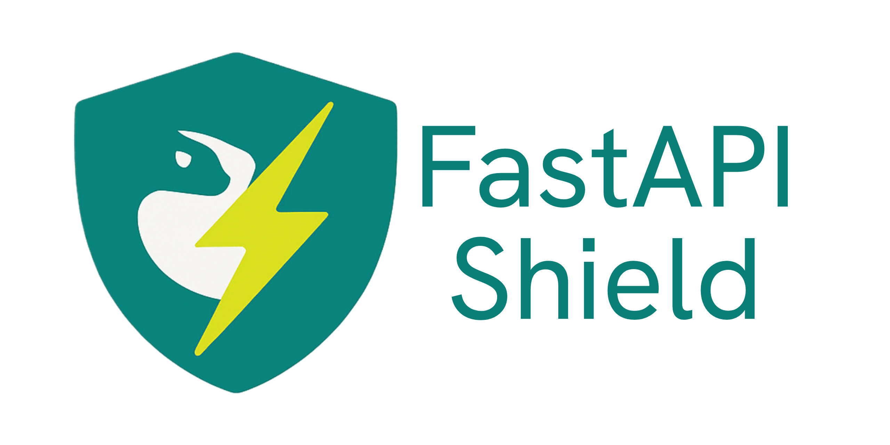

<div align="center">

</img>

# FastAPI Shield

## Documentation
<a href="https://fastapi-shield.readthedocs.io">
  
</a>

## Compatibility and Version

<a href="https://pypi.python.org/pypi/fastapi-shield"></a>

### License and Issues
<a href="https://github.com/jimchng/fastapi-shield/blob/main/LICENSE"></a>

</div>

A powerful, intuitive, and flexible authentication and authorization library for FastAPI applications. Stack your shields to create robust and customizable layers which effectively shields your endpoints from unwanted requests.

# Features

- **Decorator-based Security**: Apply shields as simple decorators to protect your endpoints
- **Layered Protection**: Stack multiple shields for fine-grained access control
- **Clean Design Pattern**: Shields provide a clear and intuitive metaphor for API protection
- **Fully Integrated**: Works seamlessly with FastAPI's dependency injection system
- **Type Safety**: Full type hint support for better IDE integration and code quality
- **Customizable Responses**: Configure error responses when access is denied
- **ShieldedDepends**: Special dependency mechanism for protected resources
- **Lazy-Loading of Dependencies**: Dependencies are only loaded from FastAPI after the request passes through all the decorated shields

# Installation

```bash
pip install fastapi-shield
```

# Basic Usage

## 🛡️ Create your First Shield

Let's create a simple `@auth_shield` to shield against unauthenticated requests! 🛡️

```python
from fastapi import Header
from fastapi_shield import shield

# Create a simple authentication shield
@shield
def auth_shield(api_token: str = Header()):
    """
    A basic shield that validates an API token.
    Returns the token if valid, otherwise returns None which blocks the request.
    """
    if api_token in ("admin_token", "user_token"):
        return api_token
    return None
```

Now that you've created your first shield, you can easily apply it to any FastAPI endpoint! 🚀

The shield acts as a decorator that protects your endpoint from unauthorized access. 

When a request comes in, the shield evaluates the API token before the endpoint function is called.

If the token is invalid (returning None), the request is blocked! 🚫 

This creates a clean separation between authentication logic and business logic, making your code more maintainable.

Just like a real shield, it stands in front of your endpoint to protect it! 💪


## See your First Shield in Action

Now let's see how our shield works in the wild! 🚀 When a user tries to access the protected endpoint, the shield jumps into action like a superhero! 🦸‍♀️

```python
from fastapi import FastAPI

app = FastAPI()

# Protected endpoint - requires authentication
@app.get("/protected/{name}")
@auth_shield # apply `@auth_shield`
async def protected_endpoint(name: str):
    return {
        "message": f"Hello {name}. This endpoint is protected!",
    }
```

```python
from fastapi.testclient import TestClient

client = TestClient(app)

def test_protected():
    client = TestClient(app)
    response = client.get("/protected/John", headers={"API-TOKEN": "valid_token"})
    assert response.status_code == 200
    assert response.json() == {"message": "Hello John. This endpoint is protected!"}


def test_protected_unauthorized():
    client = TestClient(app)
    response = client.get("/protected/John", headers={"API-TOKEN": "invalid_token"})
    assert response.status_code == 500
    assert response.json() == {'detail': 'Shield with name `unknown` blocks the request'}, response.json()
```

From the above, we can see how the shield works in practice. The `auth_shield` decorator is applied to our endpoint, checking the API token in the request headers before allowing access to the protected endpoint. When a valid token is provided, the request proceeds normally and returns a friendly greeting. However, when an invalid token is sent, the shield blocks the request, returning a 500 error with a message indicating that the shield has prevented access. This demonstrates the power of shields as a clean, declarative way to implement authentication in FastAPI applications without cluttering your endpoint logic with authorization checks.

<div align="center">
  
  
  ### 🎉 Congratulations! You've made your First Wonderful Shield! 🎉
</div>

## Your Second Shield! 🛡️🛡️

First, let's see what's the final endpoint is going to look like:

```python
@app.get("/products")
@auth_shield
@roles_shield(["user"])
async def get_all_products(db: Dict[str, Any]=Depends(get_db), username: str=ShieldedDepends(get_username_from_payload)):
    """Only user with role `user` can get their own product"""
    products = list(map(lambda name: db["products"][name], db["users"][username]["products"]))
    return {
        "message": f"These are your products: {products}",
    }
```

We're going to make the `@roles_shield(["user"])`.

But before that, there's one point to note: one of the advantages of `fastapi-shield` is that it enables lazy injection of FastAPI's dependencies.

In the signature of the endpoint: `async def get_all_products(db: Dict[str, Any]=Depends(get_db), username: str=ShieldedDepends(get_username_from_payload))`, the `db: Dict[str, Any]=Depends(get_db)` is only injected after `@roles_shield(["user"])` becomes 'unblocked', i.e. allowing the request to reach the endpoint `get_all_products`. Prior to that, if the request is blocked by any of the decoratored shields, e.g. `@auth_shield` and `@roles_shield(["user"])`, then the FastAPI's dependencies are not injected.


```python
from fastapi import FastAPI, Header
from fastapi_shield import Shield, ShieldedDepends, shield

app = FastAPI()

# Create a simple authentication shield
@shield
def auth_shield(api_token: str = Header()):
    """
    A basic shield that validates an API token.
    Returns the token if valid, otherwise returns None which blocks the request.
    """
    if api_token == "valid_token":
        return api_token
    return None

# Create a role-based shield factory
def roles_required(required_roles: list[str]):
    @shield
    def role_shield(token_data: dict = ShieldedDepends(auth_shield)):
        user_roles = token_data.get("roles", [])
        if any(role in user_roles for role in required_roles):
            return token_data
        return None
    return role_shield

# Create shortcut shields
admin_shield = roles_required(["admin"])
user_shield = roles_required(["user", "admin"])

# Public endpoint
@app.get("/public")
async def public_endpoint():
    return {"message": "This endpoint is public!"}

# Protected endpoint - requires authentication
@app.get("/protected")
@auth_shield
async def protected_endpoint(token: str = ShieldedDepends(lambda t: t)):
    return {
        "message": "This endpoint is protected!",
        "token": token
    }

# Admin-only endpoint
@app.get("/admin")
@auth_shield
@admin_shield
async def admin_endpoint():
    return {"message": "This endpoint is for admins only!"}

# User-level endpoint
@app.get("/user")
@auth_shield
@user_shield
async def user_endpoint():
    return {"message": "This endpoint is for users and admins!"}
```

## Advanced Example

Check out the complete product catalog API example in the [`examples/app`](examples/app) directory, which demonstrates:

- Authentication with token-based shields
- Role-based access control
- Protecting user information
- Admin-only operations for products
- Testing protected endpoints with TestClient

```python
# Shield for requiring specific roles
def roles_required(roles: List[str]):
    """
    Role-based authorization shield that checks if the authenticated user
    has any of the required roles.
    """
    @shield
    def role_shield(token: str = ShieldedDepends(lambda t: t)):
        token_data = get_token_data(token)
        user_roles = token_data.get("roles", [])
        
        # Check if user has any of the required roles
        if any(role in user_roles for role in roles):
            return token_data
        
        # No matching roles, return None to block the request
        return None
        
    return role_shield

# Shortcut shields for common role checks
admin_required = roles_required(["admin"])
user_required = roles_required(["user", "admin"])
```

## Documentation

Visit our documentation for more details:

- **Getting Started**: Installation, basic usage, and core concepts
- **Shields Guide**: Understanding the Shield pattern
- **Authentication**: Token-based, OAuth, and custom authentication shields
- **Authorization**: Role-based access control and permission shields
- **Advanced Usage**: Complex security scenarios and custom shield creation, e.g. rate limiting shield
- **Examples**: Complete application examples

## How It Works

FastAPI Shield uses a layered decorator pattern to apply security checks:

1. **Define Shields**: Create functions decorated with `@shield` that validate authentication or authorization
2. **Stack Shields**: Apply multiple shields to endpoints in the desired order
3. **Access Protected Resources**: Use `ShieldedDepends` to access data from successful shields
4. **Handle Failures**: Customize error responses when shield validation fails

Each shield acts as an independent layer of security that can:
- Allow the request to continue when it passes validation (returns a value)
- Block the request when validation fails (returns None)
- Pass state to dependent shields (via ShieldedDepends)

## Development

### Prerequisites

- Python 3.9 or higher
- FastAPI 0.100.1 or higher

### Install Development Dependencies

```bash
pip install uv
uv sync --dev
```

### Building from Source

```bash
git clone https://github.com/jimchng/fastapi-shield.git
cd fastapi-shield
pip install uv
uv sync --dev
```

### Running Tests

```bash
# Install `uv`
pip install uv

# Install `nox`
uv add --dev nox

# Or use `nox` as a tool
uv tool install nox

# Run all tests
uv run python -m nox -s test

# OR
uv tool run nox -s test

# Run specific test suite
nox -s test -- tests/test_basics.py
```

## Contributing

We welcome contributions! Please see our Contributing Guide for details.

## License

This project is licensed under the MIT License - see the [LICENSE](LICENSE) file for details.

## Acknowledgments

Special thanks to all contributors who have helped shape this project.
