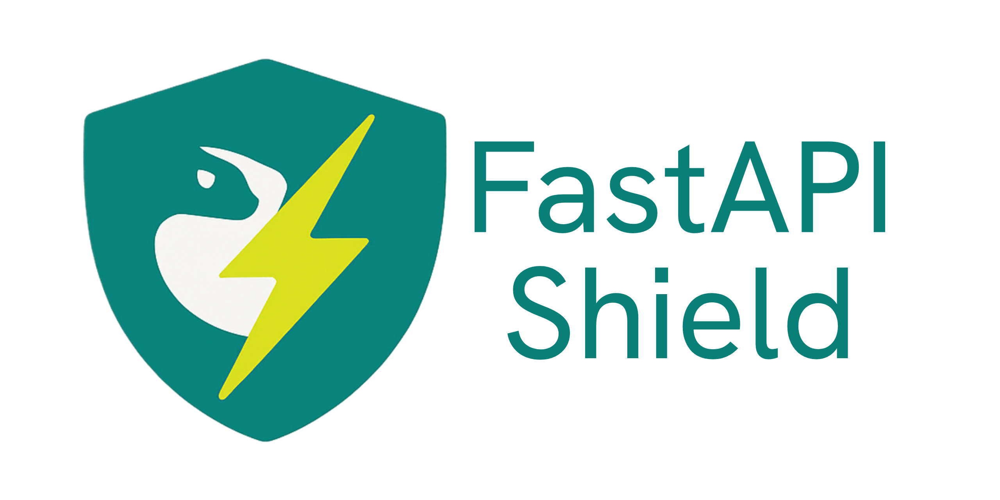

# FastAPI Shield

<div align="center">

</div>

A powerful, intuitive, and flexible authentication and authorization library for FastAPI applications. Stack your shields to create robust and customizable layers which effectively shields your endpoints from unwanted requests.

## Features

- **Decorator-based Security**: Apply shields as simple decorators to protect your endpoints
- **Layered Protection**: Stack multiple shields for fine-grained access control
- **Clean Design Pattern**: Shields provide a clear and intuitive metaphor for API protection
- **Fully Integrated**: Works seamlessly with FastAPI's dependency injection system
- **Type Safety**: Full type hint support for better IDE integration and code quality
- **Customizable Responses**: Configure error responses when access is denied
- **ShieldedDepends**: Special dependency mechanism for protected resources
- **Lazy-Loading of Dependencies**: Dependencies are only loaded from FastAPI after the request passes through all the decorated shields

## Installation

With `pip`:
```bash
pip install fastapi-shield
```

With `uv`:
```bash
uv add fastapi-shield
```

With `poetry`:
```bash
poetry add fastapi-shield
```

## Quick Start

```python
from fastapi import FastAPI, Header
from fastapi_shield import shield

app = FastAPI()

# Create a simple authentication shield
@shield
def auth_shield(api_token: str = Header()):
    """
    A basic shield that validates an API token.
    Returns the token if valid, otherwise returns None which blocks the request.
    """
    if api_token in ("admin_token", "user_token"):
        return api_token
    return None

# Protected endpoint - requires authentication
@app.get("/protected/{name}")
@auth_shield
async def protected_endpoint(name: str):
    return {
        "message": f"Hello {name}. This endpoint is protected!",
    }
``` 